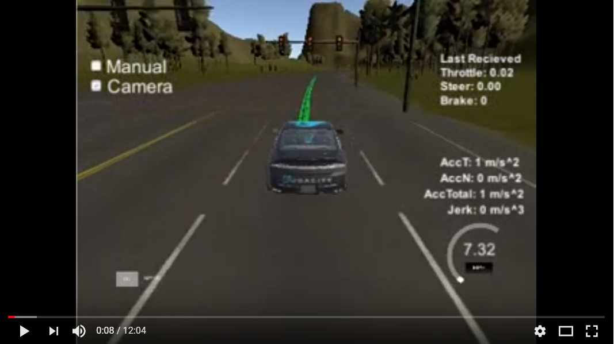
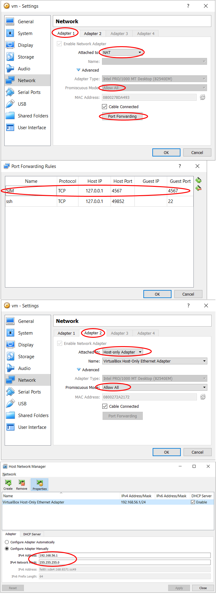

# Capstone

---

For this project, most of the code I referenced Walkthrough. Then I made some modifications based on this. I didn't do more in-depth experiments because of computer performance.

## 1. Output Video

This video comes from my local computer. For performance reasons, only the traffic light state provided by the simulator is used, and the classifier is not used when recoding. Processing failed at one traffic light after loading the classifier in Workspace.

[](https://youtu.be/lBErd-xCmdY)

## 2. Latency

In order to run this program on my laptop without GPU, I spent a lot of time processing the latency, although it still can't run after loading the classifier, but it can solve most problems. Below are a lot of solutions I found in the forums and Slack. To combine these, the car runs smoothly after the Camera is turned on in the simulator and the classifier is turned off.

1. [Skip some camera data publish](https://carnd.slack.com/archives/C6NVDVAQ3/p1506846710000025?thread_ts=1506794739.000078&cid=C6NVDVAQ3
).
2. [Performance Issue on VM](https://github.com/jdleesmiller/CarND-Capstone/commit/33dae9248a73feab9b577dd135116b6575e85788).

3. A letency [summary](https://discussions.udacity.com/t/tip-rate-limiting-to-fix-high-vm-cpu-control-latency-off-road-driving/443576).

4. Decrease LOOKAHEAD_WPS to 100 and WaypointUpdater loop rate to 10.

5. Start processing images when the traffic light is approaching.

6. Close all other programs.

## 3. Setup

I use window10, VirtualBox for ubuntu. Below is my configuration.

### 3.1. Virtual Box Configuration

<p align="center">

</p>

### 3.2. Windows 10 Setup

1. "command prompt" runs as administrator.
2. Input this command: "netsh interface portproxy add v4tov4 listenport=4567 listenaddress=127.0.0.1 connectport=4567 connectaddress=192.168.56.102 protocol=tcp".

## 4. Traffic Light Classification

I use SSD Inception V2 model, mainly refer to this [document](https://github.com/alex-lechner/Traffic-Light-Classification/blob/f436da70fc9de10da80168f8efbb524c01da5c47/README.md#training) for the classifier.


---

# Project

This is the project repo for the final project of the Udacity Self-Driving Car Nanodegree: Programming a Real Self-Driving Car. For more information about the project, see the project introduction [here](https://classroom.udacity.com/nanodegrees/nd013/parts/6047fe34-d93c-4f50-8336-b70ef10cb4b2/modules/e1a23b06-329a-4684-a717-ad476f0d8dff/lessons/462c933d-9f24-42d3-8bdc-a08a5fc866e4/concepts/5ab4b122-83e6-436d-850f-9f4d26627fd9).

Please use **one** of the two installation options, either native **or** docker installation.

### Native Installation

* Be sure that your workstation is running Ubuntu 16.04 Xenial Xerus or Ubuntu 14.04 Trusty Tahir. [Ubuntu downloads can be found here](https://www.ubuntu.com/download/desktop).
* If using a Virtual Machine to install Ubuntu, use the following configuration as minimum:
  * 2 CPU
  * 2 GB system memory
  * 25 GB of free hard drive space

  The Udacity provided virtual machine has ROS and Dataspeed DBW already installed, so you can skip the next two steps if you are using this.

* Follow these instructions to install ROS
  * [ROS Kinetic](http://wiki.ros.org/kinetic/Installation/Ubuntu) if you have Ubuntu 16.04.
  * [ROS Indigo](http://wiki.ros.org/indigo/Installation/Ubuntu) if you have Ubuntu 14.04.
* [Dataspeed DBW](https://bitbucket.org/DataspeedInc/dbw_mkz_ros)
  * Use this option to install the SDK on a workstation that already has ROS installed: [One Line SDK Install (binary)](https://bitbucket.org/DataspeedInc/dbw_mkz_ros/src/81e63fcc335d7b64139d7482017d6a97b405e250/ROS_SETUP.md?fileviewer=file-view-default)
* Download the [Udacity Simulator](https://github.com/udacity/CarND-Capstone/releases).

### Docker Installation
[Install Docker](https://docs.docker.com/engine/installation/)

Build the docker container
```bash
docker build . -t capstone
```

Run the docker file
```bash
docker run -p 4567:4567 -v $PWD:/capstone -v /tmp/log:/root/.ros/ --rm -it capstone
```

### Port Forwarding
To set up port forwarding, please refer to the [instructions from term 2](https://classroom.udacity.com/nanodegrees/nd013/parts/40f38239-66b6-46ec-ae68-03afd8a601c8/modules/0949fca6-b379-42af-a919-ee50aa304e6a/lessons/f758c44c-5e40-4e01-93b5-1a82aa4e044f/concepts/16cf4a78-4fc7-49e1-8621-3450ca938b77)

### Usage

1. Clone the project repository
```bash
git clone https://github.com/udacity/CarND-Capstone.git
```

2. Install python dependencies
```bash
cd CarND-Capstone
pip install -r requirements.txt
```
3. Make and run styx
```bash
cd ros
catkin_make
source devel/setup.sh
roslaunch launch/styx.launch
```
4. Run the simulator

### Real world testing
1. Download [training bag](https://s3-us-west-1.amazonaws.com/udacity-selfdrivingcar/traffic_light_bag_file.zip) that was recorded on the Udacity self-driving car.
2. Unzip the file
```bash
unzip traffic_light_bag_file.zip
```
3. Play the bag file
```bash
rosbag play -l traffic_light_bag_file/traffic_light_training.bag
```
4. Launch your project in site mode
```bash
cd CarND-Capstone/ros
roslaunch launch/site.launch
```
5. Confirm that traffic light detection works on real life images
